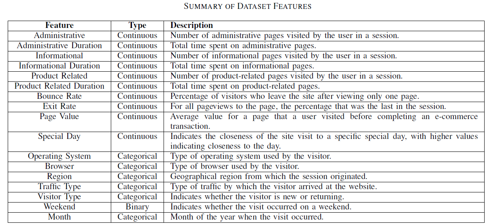

# Topic: Online-Shoppers-Purchasing-Intention

# Dataset:

The dataset consists of 10 numerical and 8 categorical attributes belonging to 12,330 sessions. 
The dataset was formed so that each session
would belong to a different user in a 1-year period to avoid
any tendency to a specific campaign, special day, user
profile, or period.
The **'Revenue'** attribute is used as the target class which is a binary categorical variable indicating
whether a visitor's session on the e-commerce website resulted in a transaction.

