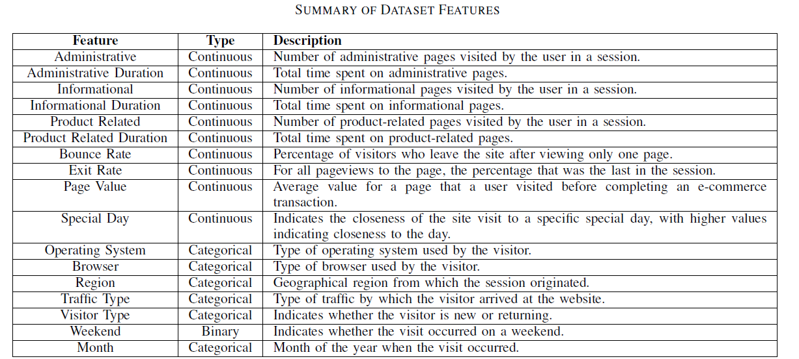
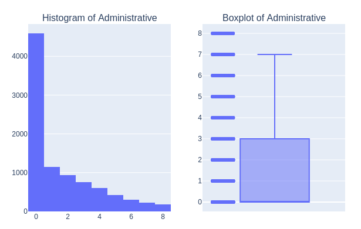
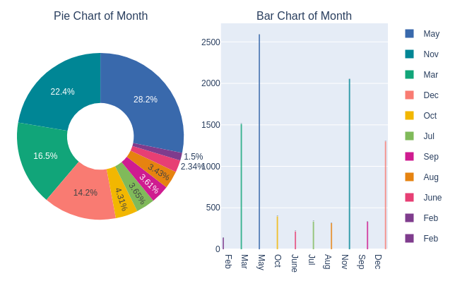

# Topic: Online-Shoppers-Purchasing-Intention

# Dataset:

The dataset consists of 10 numerical and 8 categorical attributes belonging to 12,330 sessions. 
The dataset was formed so that each session
would belong to a different user in a 1-year period to avoid
any tendency to a specific campaign, special day, user
profile, or period.
The **'Revenue'** attribute is used as the target class which is a binary categorical variable indicating
whether a visitor's session on the e-commerce website resulted in a transaction.

# Insights
## Univariate Analysis
### Quantitative features
1. When users visit the website, they spend a lot of time on product-related pages but little time on administrative and informational pages. This shows a high level of interest in product-related pages.

2. BounceRates, ExitRates and PageValues are almost equal to 0

3. 10% of users visit the website during a SpecialDay period

### Qualitative features

1. Users visit the website during mostly during May, November, March and December by using Operating Systems 2 and Browser 2.

2. Users are located most frequently in Region 1 and Region 3.

3. Visitors to the website are mostly returning users.

### Some Charts

